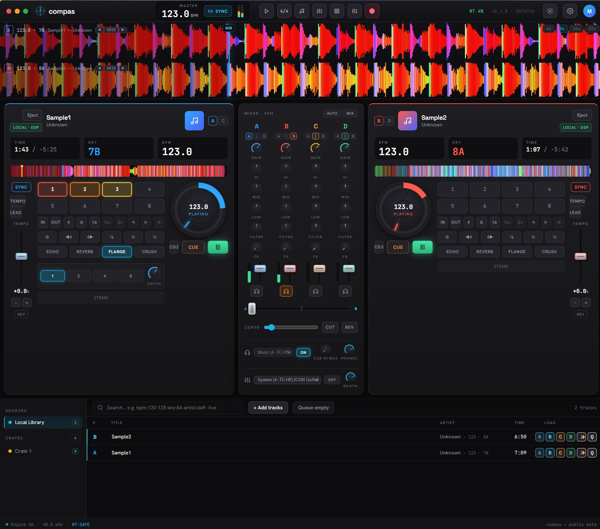

<p align="center">
  
</p>

<h1 align="center">Compás DJ</h1>

<p align="center"><em>The DJ/performance app in the <strong>Compás</strong> family — a shared Rust audio
core, focused products on top. A <strong>Compás Studio</strong> DAW is planned.</em></p>

A cross-platform, real-time professional DJ application. Rust audio core + TypeScript UI in a
**Tauri 2** shell. Windows is the primary target; **macOS is first-class**; Linux is best-effort.

> **Scope & honesty.** Compás DJ does **true DSP mixing on local DRM-free files** — that is the real
> DJ engine, and the focus of the app today. Optional streaming-service control decks are on the
> roadmap; since services expose **playback control, not decoded audio**, any such deck would be
> control-only by design and the UI would disable the DSP it can't perform. See `ARCHITECTURE.md` §1.

Status: **active development.** The local DJ engine is functionally complete and self-reported
working in the app; work now is on a richer performance/library layer and a signed public release,
plus planning **Compás Studio** (the DAW). See `ROADMAP.md` for the full plan, `STATUS.md` for the
live resume point, and `docs/COMPAS-STUDIO-PLAN.md` for the DAW roadmap.

### What it does today

- **4 decks**, in-RAM decode with a cubic-Hermite play-head (instant seek/varispeed/scratch/loops).
- **Mixer:** equal-power crossfader (per-deck assign), per-deck gain, full-kill 3-band EQ, HPF/LPF filter.
- **Analysis:** BPM + beatgrid + musical key (Camelot), scrolling zoom + overview waveforms, manual grid nudge.
- **Tempo:** varispeed + fine trim, **continuous tempo+phase SYNC** (audio-thread PLL), **key-lock** (in-house WSOLA).
- **Performance:** beat loops, hot cues, **jog-wheel scratch**, beat-jump, loop-roll w/ true slip, quantize.
- **FX rack** (per-deck inserts): echo/delay, reverb, beat-synced flanger, bitcrusher.
- **Sampler:** 8 performance pads (one-shots + per-pad loops) on the master bus.
- **MIDI:** controller input + per-target MIDI-learn mapping; one-click Akai MPK Mini MK3 profile.
- **Headphone/cue (PFL)** monitoring on a 2nd output, **master WAV recording**, **auto-mix** transitions.
- **Library:** local SQLite track DB (cues/loops/grid/gain/play-history persisted), search, A/B/C/D load.
- **Release:** in-app auto-update + a manual "check for updates" version chip.

> Coming next: playlists/crates depth, harmonic-mixing assist, an expanded FX/controller-scripting
> layer, and the **Compás Studio** DAW on the shared core. See `ROADMAP.md`.
>
> _Note: AI stem separation (Demucs/htdemucs) was removed — the upstream project is archived and
> we're not shipping AI for now._

## Download

Prebuilt installers for **Windows, macOS, and Linux** are published on the
[**Releases**](https://github.com/sergiogallegos/compas/releases/latest) page (built and attached by
CI on each `v*` tag). The project landing page in `website/` links directly to the latest per-OS
installer. The app then keeps itself current via the built-in updater.

> **Beta builds aren't code-signed yet**, so your OS will warn on first launch (the app is safe — it's
> Gatekeeper / SmartScreen blocking an unsigned download):
> - **Windows:** SmartScreen → **More info → Run anyway**.
> - **macOS:** if you see *"Compás DJ.app is damaged and can't be opened"* (common on Apple Silicon),
>   drag it to **Applications**, then run `xattr -cr "/Applications/Compás DJ.app"` in Terminal and open
>   it. Signed/notarized macOS + Windows builds are pending a paid Developer ID / code-signing cert.



> The performance UI (Traktor-inspired dark theme): dual decks with per-deck color identity, center
> mixer (gain / 3-band EQ / filter / FX), stacked band-colored waveform lanes, library browser, and a
> live engine status bar. Brand mark = the "Needle & Rose" — a compass needle (the tonearm) inside a
> beat-ticked ring (*compás* = beat/measure).

## Layout

```
crates/compas-core      domain types (TrackMetadata, SourceCapabilities, errors)
crates/compas-dsp       real-time-safe DSP + offline BPM/key analysis
crates/compas-audio     cpal engine, lock-free rings, mixer
crates/compas-sources   AudioSource abstraction: local-file decode + streaming control
src-tauri               Tauri 2 app (commands, engine thread)
frontend                React + Vite + TypeScript UI
website                 static landing page (downloads + repo link; deploy to Pages/Netlify)
```

Contributing & orientation: see `CONTRIBUTING.md` and `AGENTS.md`. Changes are tracked in
`CHANGELOG.md`. CI (fmt + clippy + tests + frontend build + audit) runs on every push/PR.

## Prerequisites

- **Rust** (stable ≥ 1.82) — https://rustup.rs
- **Node.js** ≥ 18 and **npm**
- **Windows:** [WebView2 runtime](https://developer.microsoft.com/microsoft-edge/webview2/)
  (preinstalled on Windows 11) and the **MSVC build tools** (Visual Studio C++ workload).
- **macOS:** Xcode Command Line Tools (`xcode-select --install`).
- **Tauri CLI:** `cargo install tauri-cli --version "^2"` (or use the copy installed under
  `frontend/node_modules` — see below).

## Build & run the engine (no GUI, fast)

The four engine crates build/test without WebView2 or a frontend build:

```bash
cargo check            # checks the engine crates (workspace default-members)
cargo test             # runs DSP/source unit tests
cargo clippy           # lint
```

## Run the full app (desktop)

Compás DJ lives in `apps/compas-dj/` (`src-tauri/` + `frontend/`). Run the Tauri CLI **from that
product directory** so it finds its `src-tauri/` sibling:

```bash
# 1) install frontend deps (once)
cd apps/compas-dj/frontend && npm install && cd ../../..

# 2) dev mode (hot-reload UI + native rebuilds) — run from apps/compas-dj/
cd apps/compas-dj
frontend/node_modules/.bin/tauri dev          # macOS/Linux
frontend\node_modules\.bin\tauri.cmd dev      # Windows
#   ...or, with a global CLI: cargo tauri dev
```

`tauri dev` runs the Vite dev server (`http://localhost:5173`) and the native shell together.

## Build a release bundle

```bash
cd apps/compas-dj && cargo tauri build   # installers under target/release/bundle/
```

App icons are generated from the "Needle & Rose" brand mark via `npm run icons` (in
`apps/compas-dj/frontend/`, requires `sharp`), which rasterizes the SVG to
`apps/compas-dj/src-tauri/icons/*`.

## Notes for contributors

- **Real-time discipline:** nothing in the audio callback may allocate, lock, block, log, or
  panic. Functions safe to call there carry an `RT-SAFE` doc-comment; respect it. See
  `ARCHITECTURE.md` §8.
- **Error handling:** `Result`-based; no `unwrap()`/`expect()` in non-test code.
- **Cross-platform from commit one:** gate any platform-specific code and document it.
- Keep `ARCHITECTURE.md` and `ROADMAP.md` updated alongside code changes.

See `CONTRIBUTING.md` for the full workflow and `CODE_OF_CONDUCT.md` for community expectations.
Good first issues: widening loops/cue modes, library crates/playlists, and FX additions — see
`ROADMAP.md`.

## License

compas is **open-source under the [MIT License](LICENSE)** — permissive: use, modify, and
redistribute, including commercially, with attribution. The engine implements time-stretch/key-lock
and beat/key detection **in-house** (no copyleft DSP dependency); the optional FFmpeg decode fallback
is dynamically linked and documented. See `ROADMAP.md` for the full dependency-licensing table.

## Acknowledgements

compas is an independent project. Thanks to the Rust audio ecosystem it builds on — `cpal`,
`symphonia`, `rubato`, `rtrb`, `rustfft`, and `tauri` — and to the broader DJ-software community
whose decades of established UX conventions informed the feature set.
