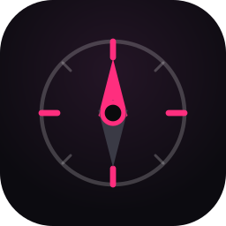
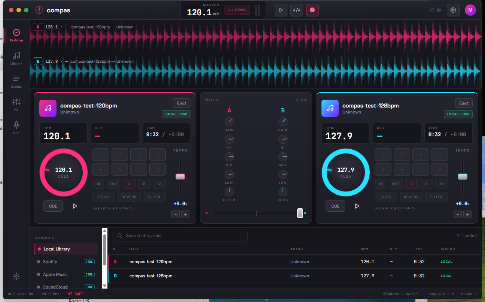

<p align="center">
  
</p>

<h1 align="center">compas</h1>

A cross-platform, real-time professional DJ application. Rust audio core + TypeScript UI in a
**Tauri 2** shell. Windows is the primary target; **macOS is first-class**; Linux is best-effort.

> **Scope & honesty.** compas does **true DSP mixing only on local DRM-free files** — that is the
> real DJ engine. Streaming services (Spotify / Apple Music / SoundCloud) expose **playback
> control only, never decoded audio**, so streaming decks are control-only and the UI disables
> the DSP they can't perform. For **personal, non-commercial use**. See `ARCHITECTURE.md` §1 and
> `docs/djvibebar-review.md` §6 for why.

Status: **Phase 1 — local-file dual-deck engine** (in progress). Two local decks decode, play, mix
through a crossfader + 3-band EQ + filter, with BPM detection, waveforms, and varispeed beatmatch.
See `ROADMAP.md`.



> The performance UI: dual decks (A magenta = full DSP, B cyan), center mixer, stacked waveform
> lanes, library browser, and a live engine status bar. Brand mark = the "Needle & Rose" — a
> compass needle (the tonearm) inside a beat-ticked ring (*compás* = beat/measure).

## Layout

```
crates/compas-core      domain types (TrackMetadata, SourceCapabilities, errors)
crates/compas-dsp       real-time-safe DSP + offline BPM/key analysis
crates/compas-audio     cpal engine, lock-free rings, mixer
crates/compas-sources   AudioSource abstraction: local-file decode + streaming control
src-tauri               Tauri 2 app (commands, engine thread)
frontend                React + Vite + TypeScript UI
website                 static landing page (downloads + repo link; deploy to Pages/Netlify)
```

Contributing & orientation: see `CONTRIBUTING.md` and `AGENTS.md`. Changes are tracked in
`CHANGELOG.md`. CI (fmt + clippy + tests + frontend build + audit) runs on every push/PR.

## Prerequisites

- **Rust** (stable ≥ 1.82) — https://rustup.rs
- **Node.js** ≥ 18 and **npm**
- **Windows:** [WebView2 runtime](https://developer.microsoft.com/microsoft-edge/webview2/)
  (preinstalled on Windows 11) and the **MSVC build tools** (Visual Studio C++ workload).
- **macOS:** Xcode Command Line Tools (`xcode-select --install`).
- **Tauri CLI:** `cargo install tauri-cli --version "^2"` (or use `npm run tauri` from `frontend/`).

## Build & run the engine (no GUI, fast)

The four engine crates build/test without WebView2 or a frontend build:

```bash
cargo check            # checks the engine crates (workspace default-members)
cargo test             # runs DSP/source unit tests
cargo clippy           # lint
```

## Run the full app (desktop)

```bash
# 1) install frontend deps (once)
cd frontend && npm install && cd ..

# 2) dev mode (hot-reload UI + native rebuilds)
cargo tauri dev
#   ...or, without the global CLI:
cd frontend && npm run tauri dev
```

`cargo tauri dev` runs the Vite dev server (`http://localhost:5173`) and the native shell together.

## Build a release bundle

```bash
cargo tauri build      # produces installers under target/release/bundle/
```

App icons are generated from the "Needle & Rose" brand mark via `npm run icons` (in
`frontend/`, requires `sharp`), which rasterizes the SVG to `src-tauri/icons/*`.

## Notes for contributors

- **Real-time discipline:** nothing in the audio callback may allocate, lock, block, log, or
  panic. Functions safe to call there carry an `RT-SAFE` doc-comment; respect it. See
  `ARCHITECTURE.md` §8.
- **Error handling:** `Result`-based; no `unwrap()`/`expect()` in non-test code.
- **Cross-platform from commit one:** gate any platform-specific code and document it.
- Keep `ARCHITECTURE.md` and `ROADMAP.md` updated alongside code changes.
